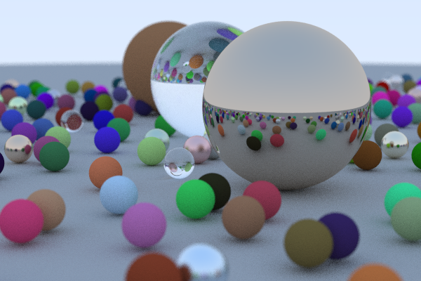

GPU-Accelerated Path Tracer
===========

This is a **work-in-progress** CUDA implementation of a path tracer, largely based on Peter Shirley’s [*Ray Tracing in One Weekend*]() series of tutorials plus other resources.

Features currently implemented are:

* Materials: Difuse, Metallic Dielectric and Emissive.
* Area lights.
* Bounding Volume Hierarchy  (BVH) partitioning.
* Depth of Field.
* Geometry: spheres and planes.

Future features will include:

* Arbitrary geometry (i.e.: FBX, OBJ).
* Monte Carlo integration.
* Deep-Learing-based supersampling.

For more details see [here](https://0xfede.io/2020/04/16/pathTracer.html)

Dependencies:
=============

### CUDA Version:
The CUDA version is implemented as a Visual Studio 2019 project and requires [CUDA Toolkit 10.2](https://developer.nvidia.com/cuda-downloads) for cuda, curand and a couple things from the thrust library.

### CPU-Only Version:
There is also a CPU-only implementation closely following Shirley's *Ray Tracing in One Weekend* as an Xcode project for MacOS. This version only requires [glm](https://glm.g-truc.net/0.9.9/index.html) (included in the *Xcode* folder) for some SIMD / broadcasting operations.

The CPU-only version does not implement emissive materials nor plane geometry and will not be further updated.

Installation:
=============
Clone the repo and compile the Visual Studio (for CUDA) or Xcode project. Then run it!

*References:*

* [Peter Shirley - Ray Tracing in One Weekend](https://raytracing.github.io/)
* [UC Berkeley CS184 slides](https://cs184.eecs.berkeley.edu/sp20)
* [Stanford CS148: Reflections and Refractions notes](https://graphics.stanford.edu/courses/cs148-10-summer/docs/2006--degreve--reflection_refraction.pdf)

[LinkedIn](https://www.linkedin.com/in/federicosaldarini) |
[0xfede.io](https://0xfede.io) | [GitHub](https://github.com/saldavonschwartz)
