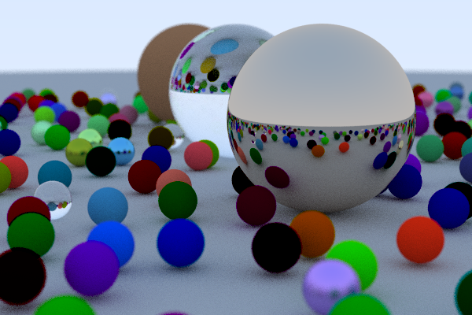

Path Tracer
===========

This is a work-in-progress implementation of a path tracer, largely based on Peter Shirley's *Ray Tracing in One Weekend* series of tutorials plus other resources.

It currently runs on MacOS and is CPU only. However the plan is to add CUDA support (perhaps Vulkan and/or Metal too) as well as to continue extending its features.

A detailed writeup of the project will eventually live `here <https://0xfede.io/2020/04/16/pathTracer.html>`_.

Dependencies:
=============
* `glm <https://glm.g-truc.net/0.9.9/index.html>`_ (included in the project).

Installation:
=============
Clone the repo and compile the Xcode project. Then run it!

*References:*

* `Peter Shirley - Ray Tracing in One Weekend <https://raytracing.github.io/>`_
* `UC Berkeley CS184 slides <https://cs184.eecs.berkeley.edu/sp20>`_
* `Stanford CS148: Reflections and Refractions notes <https://graphics.stanford.edu/courses/cs148-10-summer/docs/2006--degreve--reflection_refraction.pdf>`_

`LinkedIn <https://www.linkedin.com/in/federicosaldarini>`_ |
`0xfede.io <https://0xfede.io>`_ | `GitHub <https://github.com/saldavonschwartz>`_
